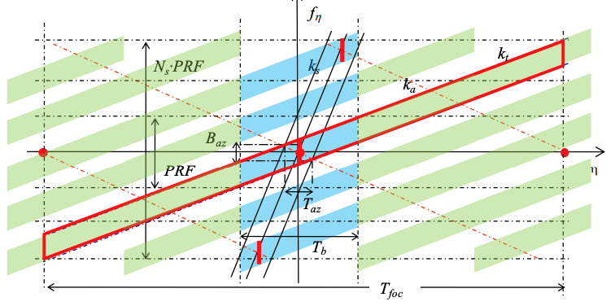

# Definition of the TOPS SLC deramping function for products generated by the S-1 IPF

- **Prepared by:** nuno miranda [cite: 1]
- **Reference:** COPE-GSEG-EOPG-TN-14-0025 [cite: 1]
- **Issue:** 1 [cite: 1]
- **Revision:** 3 [cite: 1]
- **Date of Issue:** 10/01/2017 [cite: 1]
- **Status:** Final [cite: 1]
- **Document Type:** Technical Note [cite: 1]
- **Distribution:** European Space Agency [cite: 1]

## APPROVAL

- **Title:** Definition of the TOPS SLC deramping function for products generated by the S-1 IPF [cite: 2]
- **Issue:** 1 [cite: 2]
- **Revision:** 3 [cite: 2]
- **Author:** nuno miranda [cite: 2]
- **Date:** 10/01/2017 [cite: 2]

## CHANGE LOG

| Reason for change                         | Issue | Revision | Date       |
| :---------------------------------------- | :---- | :------- | :--------- |
| Document creation                         | 1     | 0        | 21/09/2014 |
| Introduction of the demodulation term     | 1     | 1        | 30/09/2014 |
| Introduction of deramping example         | 1     | 2        | 22/04/2015 |
| Reference range updated in deramping formula | 1     | 3        | 10/01/2017 |
[cite: 3]

## CHANGE RECORD

| Issue 1             | Revision 1      |       |               |
| :------------------ | :-------------- | :---- | :------------ |
| Reason for change   | Date            | Pages | Paragraph(s)  |
| Document creation   | 21/09/2014      | All   | All           |
| Section 5           | 30/09/2014      |       |               |
| Section 6           | 22/04/2015      |       |               |
| Sections 3, 6.6     | 10/01/2017      |       |               |
[cite: 5]

## Table of contents:

1. Introduction [cite: 8]
2. Documentation [cite: 8]
3. Definition of the S-1 TOPS deramping function [cite: 8]
4. Definition of the S-1 TOPS re-ramping function [cite: 8]
5. Definition of the of the S-1 TOPS deramping and demodulation function [cite: 8]
6. Deramping example [cite: 8]
    1. Selection of a Burst [cite: 8]
    2. Doppler Centroid Rate Introduced by the Scanning of the Antenna ($k_s$) [cite: 8]
    3. Doppler FM Rate ($k_a$) [cite: 8]
    4. Doppler Centroid Rate in the Focussed TOPS SLC Data ($k_t$) [cite: 8]
    5. Doppler Centroid Frequency ($f_{\eta c}$) [cite: 8]
    6. Reference zero-Doppler Azimuth Time ($\eta_{ref}$) [cite: 8]
    7. Deramped phase ($\phi(\eta,\tau)$) [cite: 8]

## 1 INTRODUCTION

The Sentinel-1 (S-1) Instrument Processing Facility (IPF) is responsible for generating the complete family of Level-1 and Level-2 operation products [AD- 1]. [cite: 10].
It is the first SAR instrument featuring the TOPS [AD-3] mode. [cite: 11] As a matter of fact, S-1 features two TOPS mode being EWS and IWS for which the mode definition can be found in [AD-4]. [cite: 12].
The particularity of TOPS is the electronic steering of the antenna in azimuth (inverse to SPOT) to illuminate the targets with the same azimuth antenna pattern. [cite: 13] The Time /Frequency support of such data is featuring a linear frequency modulation with time in RAW data but also in the Level-1 SLC data as generated by S-1 IPF. [cite: 14].

The removal of this linear frequency modulation (also called deramping) is a key step for performing basic operation like interpolation/resampling of the data that are often used in the interferometric processing chains. [cite: 15].

This document defines the procedure for performing the deramping of S-1 TOPS IWS and EWS of Level-1 SLC products generated by the S-1 IPF. [cite: 16]

## 2 DOCUMENTATION

* **AD-1:** S-1 Product Definition, S1-RS-MDA-52-7440 [cite: 17]
* **AD-2:** S-1 Product format specification, S1-RS-MDA-52-7441 [cite: 17]
* **AD-3:** TOPSAR: Terrain Observation by Progressive, De Zan, F., & Guarnieri, A. M., Geoscience and Remote Sensing, IEEE Transactions on, 2006 vol. 44(9), pp.2352-2360. [cite: 17, 18]
* **AD-4:** Sentinel-1 SAR Performance Analysis, S1-TN-ARE-PL-0001, issue 1.7,01/03/2013 [cite: 18]
* **AD-5:** Sentinel-1 Level 1 Detailed Algorithm Definition, S1-TN-MDA-52-7445 [cite: 18]

(*) Latest version of the document is available on the S-1 product handbook web pages: https://sentinel.esa.int/web/sentinel/user-guides/sentinel-1-sar/document-library [cite: 18]

## 3 DEFINITION OF THE S-1 TOPS DERAMPING FUNCTION

The Time/Frequency support of TOPS SLC burst is defined in the S-1 IPF algorithm document [AD- 5]. [cite: 18] For completeness it is recalled in the figure below. For simplicity of representation Figure 1 assumes a Doppler centroid frequency ($f_{\eta c}$) of 0Hz. [cite: 19]


*Figure 1: Time-frequency Diagram of a TOPS SLC product (red) representing the linear variation of the Doppler frequency of the azimuth time within a burst* [cite: 21]

The same notations as defined [AD-5] is used in this section:

| Symbol        | Definition                                                                 |
| :------------ | :------------------------------------------------------------------------- |
| $\tau$        | range time [s]                                                             |
| $\eta$        | azimuth time [s]                                                           |
| $\eta_c$      | Beam centre crossing time [s]                                              |
| $\eta_{mid}$  | Mid burst zero Doppler azimuth time [s]                                    |
| $f_{\eta}$      | Azimuth frequency [Hz]                                                     |
| $f_{\eta c}$  | Doppler Centroid frequency [Hz]                                            |
| $k_a$         | Doppler FM rate [Hz/s]                                                     |
| $k_{\psi}$    | Antenna Steering rate [rad/s]                                              |
| $k_s$         | Doppler Centroid rate introduced by the scanning of the antenna $k_{\psi}$ [Hz/s]. Rate applicable to the RAW data |
| $k_t$         | Doppler centroid rate in the focused TOPS SLC data [Hz/s]                  |
| $V_S$         | Spacecraft velocity computed at mid-burst time $\eta_{mid}$ by stave vector interpolation [m/s] |
| $\lambda$     | radar wavelength [m]                                                       |
| $f_c$         | radar frequency [Hz]                                                       |
| $Nl_{burst}$  | Number of lines within a burst (same for all burst)                        |
| $\Delta t_s$         | Azimuth Time interval between two SLC lines [s]                            |
| $Nsswath$     | Number of samples within a swath (different for each swath)                |
| $\Delta\tau_S$ | Time interval between two samples [s]                                      |
[cite: 21, 22, 23]

The spectral components of the SLC are moved to low-pass band (deramped) by a multiplication in azimuth time domain with a chirp signal defined as following:

$\phi(\eta,\tau)=\exp(-j.\pi.k_{t}(\tau).(\eta-\eta_{ref}(\tau))^{2})$  (Equ. 1) [cite: 24]

where $k_t$ is defined as following:

$k_{t}(\tau)=\frac{k_{a}(\tau).k_{s}}{k_{a}(\tau)-k_{s}}=\frac{k_{s}}{\alpha}$ (Equ. 2) [cite: 24]

$k_t$ is obtained by scaling the RAW time rate ($k_s$) with the conversion factor ($\alpha$) between focused and raw time such that: [cite: 24]

$\alpha=1-\frac{k_{s}}{k_{a}(\tau)}$ (Equ. 3) [cite: 25]

$k_a$ is the classical azimuth FM rate which is always negative. [cite: 25] The azimuth FM rate is provided as a sequence of range polynomial regularly updated with azimuth time. [cite: 26] For deramping the ith burst, it is recommended to use closest polynomial to $\eta_{mid}$ of the ith burst. [cite: 27]
The Doppler rate introduced by the antenna steering is given by: [cite: 28]

$k_{s}\approx\frac{2v_{s}}{\lambda}\cdot k_{\psi}=\frac{2v_{s}}{c}\cdot f_{c}\cdot k_{\psi},$ (Equ. 4) [cite: 29]

where $k_{\psi}$ is the azimuth steering rate of the antenna in radians per second. [cite: 29] $k_s$ is not range dependent and thus can be computed once for the burst. [cite: 30] The spacecraft velocity can be computed at mid-burst time $\eta_{mid}$ by interpolation using the orbit state vectors. [cite: 31]
Finally the computation of the time function: [cite: 32]

$\eta$ is the zero-Doppler azimuth time centered in the middle of the burst, i.e., [cite: 32]

$\eta=[-\frac{Nl_{burst}}{2}\cdot\Delta t_{s},\frac{Nl_{burst}}{2}\cdot\Delta t_{s}]$ (Equ. 5) [cite: 33]

$\eta$ contains $Nl_{burst}$ elements separated by $\Delta t_s$ being the SLC azimuth time sampling.
The reference time is given by: [cite: 33]

$\eta_{ref}(\tau)=\eta_{c}(\tau)-\eta_{c}(\frac{Ns_{swath}}{2})$ (Equ. 6) [cite: 34]

with

$\eta_{c}(\tau)=-\frac{f_{\eta c}(\tau)}{k_{a}(\tau)}$ (Equ. 7) [cite: 35]

$f_{\eta c}$ is the Doppler centroid frequency which is provided as a sequence of range polynomial regularly updated with azimuth time. [cite: 35] For deramping the ith burst, it is recommended to use closest polynomial to $\eta_{mid}$ of the ith burst. [cite: 36]
Being $f_{\eta c}$ and $k_a$ range-dependent functions, $k_t$ is also a range-dependent function that needs to be recomputed regularly in range. [cite: 37] In the most accurate implementations, $k_t$ will be recomputed for each azimuth line in a burst. [cite: 38]
All the variables necessary to compute accurately the TOPS deramping function are provided as a direct annotation of the product [AD-2] or can be easily derived. [cite: 39] The table below provides the mapping between the variables and the product annotations. [cite: 40]

| variable       | annotations                                                                |
| :------------- | :------------------------------------------------------------------------- |
| $k_{\psi}$     | /product/generalAnnotation/productInformation/azimuthSteeringRate          |
| $f_{\eta_{c}}$ | /product/dopplerCentroid/dcEstimateList/dcEstimate/dataDcPolynomial        |
| $k_{a}$        | /product/generalAnnotation/azimuthFmRateList/azimuthFmRate                 |
| $f_{c}$        | /product/generalAnnotation/productInformation/radarFrequency               |
| $V_{S}$        | /product/generalAnnotation/orbitList/orbit/velocity [x,y,z]                |
| $Nl_{burst}$   | /product/swathTiming/linesPerBurst                                         |
| $\Delta t_s$          | /product/imageAnnotation/imageInformation/azimuthTimeInterval              |
| $NS_{swath}$   | /product/imageAnnotation/imageInformation/numberOfSamples                  |
| $\Delta\tau_{s}$ | 1/(/product/generalAnnotation/productInformation/rangeSamplingRate)        |
| $\tau(0)$      | /product/imageAnnotation/imageInformation/slantRangeTime                   |
*Table 1: Mapping between variables and product annotation* [cite: 41, 42]

Note that the azimuth steering rate, $k_{\psi}$, is given in degrees per second in the annotation file, and shall be converted to radians per second. [cite: 42] The other variables are already in the proper units. [cite: 43]

The correctness of the deramping can be easily assessed by performing the spectrogram before and after deramping step, as shown in the figure below. [cite: 43]


*Figure 2: Shows the spectrogram obtained from IW1 (top) before deramping in discrete frequency domain (bottom) after deramping* [cite: 44]

## 4 DEFINITION OF THE S-1 TOPS RE-RAMPING FUNCTION

The re-ramping function is similar to the deramping except for the sign, which is inversed. [cite: 44]

## 5 DEFINTION OF THE OF THE S-1 TOPS DERAMPING AND DEMODULATION FUNCTION

The functions defined in the previous are just provided for de/re-ramping around a Doppler centroid frequency. [cite: 45] This means that once deramped the azimuth spectrogram or spectra will still be centered on the Doppler centroid frequency. [cite: 46] Depending on the processing chains, a user might want (or not) to have the spectra also centered on 0Hz. [cite: 47] This step is called demodulation. [cite: 48]

In order to perform deramping and demodulation at the same time the previous deramping function can be updated as following:

$\phi(\eta,\tau)=exp(-j.\pi.k_{t}(\tau).(\eta-\eta_{ref}(\tau))^{2}-j.2.\pi.f_{\eta c}(\tau).(\eta-\eta_{ref}(\tau)))$ (Equ. 8) [cite: 49]

## 6 DERAMPING EXAMPLE

A numerical example of deramping, as described in Section 3, is given for an S1A_IW_SLC product. [cite: 50] This example will show how a complete burst can be deramped. [cite: 51]

### 6.1 Selection of a Burst

The product Annotations ADS (Annotation Data Set) [AD-2] includes information on each burst including the lines per burst, samples per burst, the number of bursts in the product together with for each burst the azimuth time of the first line of the burst, the byte offset of the burst within the image MDS and an array of integers indicating the offset of the first and last valid image samples within each range line (a -1 indicates if a range line does not contain any valid image samples). [cite: 52] This information is contained within the L1 Swath Timing ADSR (ADS Record). [cite: 53] Figure 3 shows an example of burst information for the second out of eight bursts (in this case) within an IW1 sub-swath. [cite: 54]

```xml
<swathTiming>
    <linesPerBurst>1626</linesPerBurst>
    <samplesPerBurst>20392</samplesPerBurst>
    <burstList count="8">
        <burst>
            <azimuthTime>2015-02-18T17:41:04.914859</azimuthTime>
            <azimuthAnxTime>8.428336490000000e+02</azimuthAnxTime>
            <sensingTime>2015-02-18T17:41:06.164717</sensingTime>
            <byteOffset>132629576</byteOffset>
            <firstValidSample count="1626">-1-1-1-1-1-1-1-1-1-1-1...
            ...0000-1-1-1-1-1-1-1-1-1-1-1-1-1-1-1-1-1-1-1-1-1...
            ...-1-1-1-1-1-1-1-1-1-1-1</firstValidSample>
            <lastValidSample count="1626">-1-1-1-1-1-1-1-1-1-1-1-1...
            ...20391 20391-1-1-1-1-1-1-1-1-1-1-1-1-1-1-1-1-1-1-1-1...
            ...-1-1-1-1-1-1-1-1-1-1-1-1</lastValidSample>
        </burst>
    </burstList>
</swathTiming>
```

Figure 3. Example Burst Information    

### 6.2 Doppler Centroid Rate Introduced by the Scanning of the Antenna ($k_s$)

The Doppler rate introduced by the antenna steering ($k_s$) as given in Equ. 4 requires the following parameters:    

- Azimuth time at the mid-burst time ($\eta_{mid}$)    
- Orbit state vectors spanning the burst to calculate the spacecraft velocity at the mid-burst azimuth time ($v_s$)    
- Radar frequency ($f_c$)    
- Speed of light (c)    
- Azimuth steering rate ($k_{\psi}$)    
- The azimuth time at the mid-burst ($\eta_{mid}$) is calculated from the azimuth time at the start of the burst, the lines per burst ($Nl_{burst}$) and the azimuth time interval ($\Delta t_s$):    
    - $\eta_{mid}=\eta_{start}+\Delta ts \cdot Nl_{burst}/2$ (Equ. 9)    

Using the numerical values in Figure 4 (from the L1 Swath ADSR and L1 Image ADSR) gives $\eta_{mid}=\text{2015-02-18T17:41:06.586026}$.    

```xml
<azimuthTime>2015-02-18T17:41:04.914859</azimuthTime>
<linesPerBurst>1626</linesPerBurst>
<azimuthTimeInterval>2.0555562805384406e-03</azimuthTimeInterval>
````

Figure 4. Example Mid-burst Azimuth Time Information    

Orbit state vectors spanning the burst are used to calculate the orbital velocity prior to interpolation to determine the spacecraft velocity at the mid-burst azimuth time ($V_s$).  For each azimuth time, the orbit velocity is calculated:    

$V_{s}=\sqrt{(V_{x}^{2}+V_{y}^{2}+V_{z}^{2})}$ (Equ. 10)    

Using the numerical values in Figure 5 (from the L1 General ADSR) gives the orbit velocity at the five azimuth times as 7589.7953, 7589.7768, 7589.7583, 7589.7398, 7589.7213 $\text{ m/s}$. Interpolation of these velocities using, for example a least-squares quadratic fit, gives $V_s = 7589.7505 \text{ m/s}$.    


```xml
<orbit>
    <time>2015-02-18T17:41:04.163000</time>
    <velocity>
        <x>-5.811987861370349e+03</x>
        <y>-1.489113520069542e+03</y>
        <z>4.648476235192883e+03</z>
    </velocity>
</orbit>
<orbit>
    <time>2015-02-18T17:41:05.163000</time>
    <velocity>
        <x>-5.817218162668108e+03</x>
        <y>-1.487809146251458e+03</y>
        <z>4.642317198288879e+03</z>
    </velocity>
</orbit>
<orbit>
    <time>2015-02-18T17:41:06.163000</time>
    <velocity>
        <x>-5.822441741826881e+03</x>
        <y>-1.486502352004974e+03</y>
        <z>4.636152939673951e+03</z>
    </velocity>
</orbit>
<orbit>
    <time>2015-02-18T17:41:07.163000</time>
    <velocity>
        <x>-5.827658592983404e+03</x>
        <y>-1.485193125508739e+03</y>
        <z>4.629983467457250e+03</z>
    </velocity>
</orbit>
<orbit>
    <time>2015-02-18T17:41:08.163000</time>
    <velocity>
        <x>-5.832868706606461e+03</x>
        <y>-1.483881468547715e+03</y>
        <z>4.623808786054031e+03</z>
    </velocity>
</orbit>
```

Figure 5. Example Orbit Velocity Information    

Using the numerical values in Figure 6 (from the L1 General ADSR) and $V_s$, gives the Doppler centroid rate $k_s$. Note that azimuth steering rate $k_{\psi}$ in Figure 6 needs to be converted to radians/s.  $k_s$ is not dependent on range.    

$k_s = 7596.3984 \text{ Hz/s}$    

```xml
<radarFrequency>5.405000454334350e+09</radarFrequency>
<azimuthSteeringRate>1.590368784000000e+00</azimuthSteeringRate>
```

Figure 6. Example Doppler Centroid Rate ($k_s$) Information    

### 6.3 Doppler FM Rate ($k_a$)

The Doppler FM rate ($k_a$) is dependent on range and is calculated for each range sample i.  The nearest azimuth FM rate polynomial to the azimuth mid-burst time ($\eta_{mid}$) is to be identified as shown in Figure 7 (from the L1 General ADSR).  The FM rate is calculated at a given range time, $\tau(i)$ by:    

$k_{a}(i)=c0+c1 \cdot (\tau(i)-\tau_{0})+c2 \cdot (\tau(i)-\tau_{0})^{2}$ (Equ. 11)    

where the parameters coefficients c0, c1, c2 are provided by the azimuthFmRatePolynomial field and $\tau_0$ is the 2-way slant range time origin within the azimuth FM rate information.  The slant range time of the ith sample is given by:    

$\tau(i)=\tau(0)+i \cdot \Delta\tau_{s}$ (Equ. 12)    

The range time interval between two samples ($\Delta\tau_s$) is derived from the rangeSamplingRate field (see Table 1).  The slant range time of the first sample, $\tau(i=0)=\tau(0)$, is given by the field /product/imageAnnotation/imageInformation/slantRangeTime (see Table 1).    


```xml
<azimuthFmRate>
    <azimuthTime>2015-02-18T17:41:05.331024</azimuthTime>
    <t0>5.356509155649830e-03</t0>
    <azimuthFmRatePolynomial count="3">-2.311921087579409e+03 4.4831541828596746e+05 7.926006904805526e+07</azimuthFmRatePolynomial>
</azimuthFmRate>
<generalAnnotation>
    <productInformation>
        <rangeSamplingRate>6.434523812571428e+07</rangeSamplingRate>
    </productInformation>
</generalAnnotation>
<imageAnnotation>
    <imageInformation>
        <slantRangeTime>5.356509155649830e-03</slantRangeTime>
    </imageInformation>
</imageAnnotation>
```

Figure 7. Example Doppler FM Rate ($k_a$) Information    

The variation of the Doppler FM rate, $k_a$, as a function of range sample number using the information above is shown in Figure 8.    

Figure 8. Doppler FM rate ($k_a$) as a function of range sample number    

### 6.4 Doppler Centroid Rate in the Focussed TOPS SLC Data ($k_t$)

The Doppler centroid rate ($k_t$) is dependent on range and is calculated for each range sample.  As shown in Equ. 2, $k_t$ is a function of the Doppler centroid rate introduced by the scanning of the antenna, $k_s$, as given in Section 6.2 and the Doppler FM rate, $k_a$, as given in Section 6.3.  Figure 9 shows the variation of $k_t$ with range sample number.    

Figure 9. Doppler Centroid Frequency ($k_t$) as a function of range sample number    

### 6.5 Doppler Centroid Frequency ($f_{\eta c}$)

The Doppler centroid frequency ($f_{\eta c}$) is dependent on range and is calculated for each range sample.  The nearest Doppler centroid frequency polynomial to the azimuth time at the mid-burst ($\eta_{mid}$) is to be identified as shown in Figure 10 (from the L1 Doppler Centroid ADSR). The Doppler centroid frequency is calculated at a given range time $\tau(i)$ by:    

$f_{\eta c}=c0+c1 \cdot (\tau(i)-\tau_{0})+c2 \cdot (\tau(i)-\tau_{0})^{2}$ (Equ. 13)    

where the parameters coefficients c0, c1, c2 are provided by the dataDcPolynomial field and $\tau_0$ is the 2-way slant range time origin within the Doppler centroid frequency information. Slant range time of the ith sample, $\tau(i)$, is described in Section 6.3.    


```xml
<dcEstimate>
    <azimuthTime>2015-02-18T17:41:06.293764</azimuthTime>
    <t0>5.356400367490770e-03</t0>
    <dataDcPolynomial count="3">3.486574e+01 -2.299984e+04 8.332020e+06</dataDcPolynomial>
</dcEstimate>
````

Figure 10. Example Doppler Centroid Rate ($f_{\eta c}$) Information    

The variation of the Doppler centroid frequency, $f_{\eta c}$ as a function of range sample number using the information above is shown in Figure 11.    

Figure 11. Doppler Centroid Frequency ($f_{\eta c}$) as a function of range sample number    

### 6.6 Reference zero-Doppler Azimuth Time ($\eta_{ref}$)

The reference zero-Doppler azimuth time ($\eta_{ref}$) is dependent on range and is calculated for each range sample.  As shown in Equ. 6 and Equ. 7, $\eta_{ref}$ is a function of the Doppler FM rate, $k_a$, as given in Section 6.3 and the Doppler centroid frequency, $f_{\eta c}$ as given in Section 6.5.  The variation of the reference zero-Doppler azimuth time, $\eta_{ref}$, as a function of range sample number using the information above is shown in Figure 12.    

Figure 12. Reference zero-Doppler time ($\eta_{ref}$) as a function of range sample number    

### 6.7 Deramped phase ($\phi(\eta,\tau)$)

The final step is to calculate the deramped phase for each azimuth and range pixel of the burst and apply this phase to the complex data.  Equ. 14 gives the phase (in radians) as a function of azimuth time relative to the centre of the burst $\eta$ (Equ. 5) and the Doppler Centroid Rate in the Focussed TOPS SLC Data ($k_t$) as given in Section 6.4 and the Reference zero-Doppler Azimuth Time ($\eta_{ref}$) as given in Section 6.6.    

$\phi=-\pi \cdot k_{t}(\tau) \cdot (\eta-\eta_{ref}(\tau))^{2}$ (Equ. 14)    

The phase is applied to the original SLC real ($i_{original}$) and imaginary ($q_{original}$) values to create deramped SLC real ($i_{derampted}$) and imaginary ($q_{derampted}$) values as shown in Equ. 15.    

$i_{derampted}=i_{original} \cdot cos(\phi)-q_{original} \cdot sin(\phi)$
$\eta_{derampted}=i_{original} \cdot sin(\phi)+q_{original} \cdot cos(\phi)$ (Equ. 15)    
